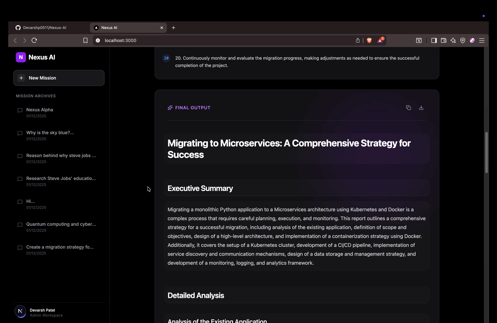

<div align="center">

# 🔮 NEXUS AI
### The Autonomous Research Architect

[](https://nextjs.org/)
[](https://fastapi.tiangolo.com/)
[](https://langchain-ai.github.io/langgraph/)
[](https://www.docker.com/)
[](https://www.postgresql.org/)

**An Event-Driven, Multi-Agent Cognitive Architecture designed to autonomously plan, research, and synthesize complex technical reports.**

[View Live Demo](https://nexus-ai-demo.com) · [Report Bug](https://github.com/Devarshp0511/Nexus-AI/issues) · [Request Feature](https://github.com/Devarshp0511/Nexus-AI/issues)

</div>

---

## 🚀 Executive Summary

**Nexus AI** represents a shift from "Chatbots" to **"Agentic Systems."**

While traditional LLMs generate text in a single pass, Nexus employs a **Graph-Based State Machine** to coordinate specialized autonomous agents. It creates a dynamic loop where a **Planner** deconstructs goals, a **Researcher** gathers ground-truth data from the live web, and a **Writer** synthesizes the findings into professional-grade reports. 

The system runs on a **Microservices Architecture** orchestrated via Docker, ensuring persistent memory and scalable execution separate from the user interface.



---

## 🏗️ System Architecture

Nexus operates on a distributed containerized stack. The **Brain** (Python) interacts with the **Body** (Docker Services) via asynchronous protocols.

```mermaid
graph TD
    User[User / Next.js Dashboard] -->|REST API| API[FastAPI Gateway]
    API -->|Trigger| Graph[LangGraph Orchestrator]
    
    subgraph "The Cognitive Architecture"
    Graph -->|Step 1| Planner[Planner Agent]
    Graph -->|Step 2| Research[Researcher Agent]
    Graph -->|Step 3| Writer[Writer Agent]
    end
    
    subgraph "Infrastructure Layer (Docker)"
    Research -->|Live Web Search| DDG[DuckDuckGo Tool]
    Graph -->|Persist State| Postgres[(PostgreSQL)]
    Graph -->|Semantic Memory| Qdrant[(Qdrant Vector DB)]
    Graph -->|Relationship Map| Neo4j[(Neo4j Graph DB)]
    end
    
    Writer -->|Final Markdown| Postgres
    Postgres -->|Fetch History| API
